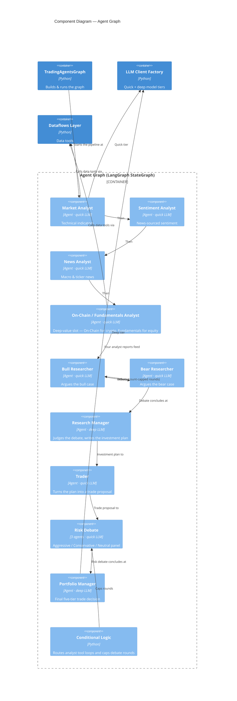

# C4 — Components: Agent Graph (the committee)

The Agent Graph is a LangGraph `StateGraph` that mirrors a trading firm:
specialist analysts feed an adversarial debate, which a manager judges,
a trader plans, a risk panel stress-tests, and a portfolio manager
decides. State flows through a shared blackboard (`AgentState`).

## Notes

- **Deep-value slot.** One analyst slot is asset-class dependent:
  `graph/setup.py` places the **On-Chain Analyst** for `asset_class=crypto`
  and the **Fundamentals Analyst** for equities. Both write the same
  `fundamentals_report` state field, so the rest of the pipeline is
  unchanged.
- **Two LLM tiers.** ~13 agents use the `quick_think_llm`; the Research
  Manager and Portfolio Manager use the stronger `deep_think_llm`. Every
  agent reaches the LLM through the LLM Client Factory (only the Market
  and Portfolio Manager edges are drawn, to keep the diagram readable).
- **Analyst tool loops.** Each analyst is a ReAct loop — it calls data
  tools through the Dataflows Layer until it has enough to write its
  report. Only the Market and On-Chain analysts' tool edges are drawn;
  the Sentiment and News analysts use data tools the same way.
- **Debate is count-capped.** Bull ⇄ Bear and the 3-way risk panel loop
  for a configurable number of rounds (`max_debate_rounds`,
  `max_risk_discuss_rounds`) before handing off to their judge.
