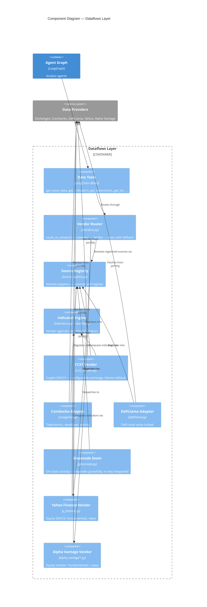

# C4 — Components: Dataflows Layer

Every data tool an agent calls is routed through a config-driven
registry. A tool names a *category*; configuration (`data_vendors` /
`tool_vendors`) names the *vendor*; the registry resolves the vendor to
an *adapter*. Adding a new data source is a `register_source()` call in
the adapter's own module — no edit to the router.

## Notes

- **Equity vs crypto vendors coexist.** Yahoo Finance and Alpha Vantage
  are declared directly in the router; crypto sources (CCXT, CoinGecko,
  DefiLlama, Glassnode) arrive through the **Source Registry** and are
  folded into the routing table on import.
- **Shared indicator engine.** `indicators.py` holds the vendor-agnostic
  stockstats engine and window formatting. Both the CCXT and Yahoo
  vendors reuse it, so crypto and equity indicator reports are identical
  in shape.
- **Graceful degradation.** Every adapter returns a clear partial-data
  message on error instead of raising. The Glassnode seam always
  degrades today — active-address / exchange-flow data needs a keyed
  provider that is not integrated (see the `crypto-trader-base` design,
  decision D6).
- **As-of bounding.** Crypto tools accept an as-of date and never return
  observations after it — required for look-ahead-free backtesting.
