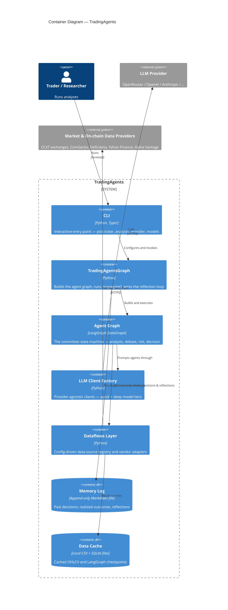

# C4 — Container Diagram

The major building blocks inside **TradingAgents**. It is a single Python
process; the "containers" below are its major subsystems and data stores.

## Notes

- **TradingAgentsGraph** (`graph/trading_graph.py`) is the orchestrator:
  it builds the graph for the configured `asset_class`, runs
  `propagate()`, and owns the deferred-reflection loop.
- **Agent Graph** is a LangGraph `StateGraph` — see
  [c4-components-agent-graph.md](c4-components-agent-graph.md).
- **Dataflows Layer** routes every data tool through a config-driven
  registry — see [c4-components-dataflows.md](c4-components-dataflows.md).
- **Memory Log** is a plain append-only Markdown file — the substrate of
  the deferred-reflection learning loop.
