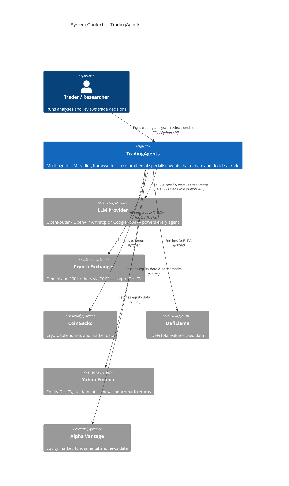

# C4 — System Context

The system context for **TradingAgents**: who uses it and which external
services it depends on.

## Notes

- **One LLM provider per run.** The provider is config-selected
  (`llm_provider`). With OpenRouter it acts as a gateway to many model
  families behind a single key.
- **Data sources are asset-class dependent.** Crypto runs use CCXT
  exchanges + CoinGecko + DefiLlama; equity runs use Yahoo Finance +
  Alpha Vantage. The asset class is set by the `asset_class` config key.
- TradingAgents is a CLI tool / Python library — it runs on the user's
  own machine, so there is no separate deployment topology to diagram.
