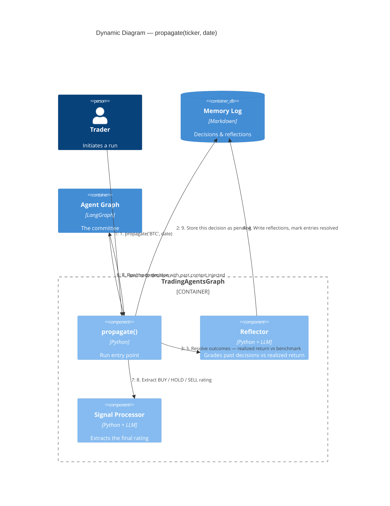

# C4 — Dynamic: a propagate() run

`propagate(ticker, date)` is one trading run. Before the committee runs,
the orchestrator resolves *past* decisions whose outcomes are now known
and feeds the lessons back in — the deferred-reflection learning loop.

## Notes

- **Steps 2–4 are the learning loop.** A decision is logged as
  `pending`; on a later run for the same ticker its real outcome is
  known, so the Reflector grades it and writes a lesson. No model
  training — the feedback is memory the next run's prompts read.
- **Step 5 injects history.** Recent same-ticker decisions and
  cross-ticker lessons are read from the Memory Log and added to the
  initial agent state, so the committee reasons with hindsight.
- **Benchmark (step 3).** Realized return is measured against a
  benchmark — SPY for equities. Crypto runs benchmark against BTC; the
  24/7-calendar variant of this step is delivered in Phase 4 of the
  `crypto-trader-base` change.
- **Checkpointing.** When `checkpoint_enabled` is set, the graph is
  compiled with a per-ticker SQLite saver so a crashed run resumes from
  the last completed node.
